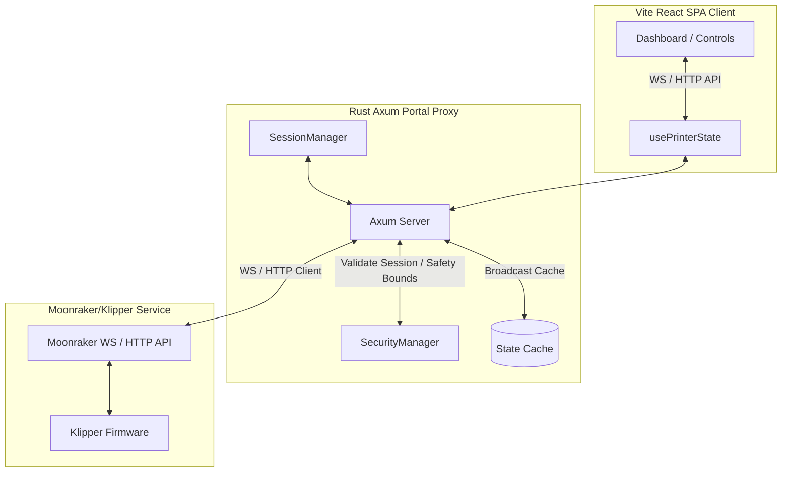

# Klipper Guest Print Portal

A secure, full-stack, guest-restricted web portal for a Klipper/Moonraker 3D printer. This project allows university students and guest users to safely monitor, control, and upload G-code files to a 3D printer without exposing raw Moonraker access, enforcing strict Role-Based Access Control (RBAC) and movement safety bounds.

---

## 🌟 Features

- **Rust/Axum Backend**: High-performance, memory-safe proxy server interfacing with the Moonraker API.
- **WebSocket State Multiplexing**: Real-time status updates broadcast from Moonraker directly to all connected frontend clients.
- **Vite + React + SCSS + TypeScript SPA**: Beautiful, modern single page application optimized for fast load times and persistent state during navigation.
- **Premium Aesthetics**: Features a fully custom design with light and dark themes tailored to academic and industrial branding, incorporating premium components and micro-interactions.
- **Configurable Safety Guardrails**:
  - Whitelisted macros for guests (e.g. filament load/unload).
  - Absolute movement (jog) steps limits.
  - Temperature caps and preset bounds for PLA, PETG, TPU, ABS.
  - Optional homing axis lockdown for guests.
  - Speed multiplication constraints.
  - Strict path traversal protection for file uploads.
- **Role-Based Access Control (RBAC)**: Secure cookie-based session management, separating `Guest` and `Admin` permissions.

---

## 🏗️ Architecture



---

## ⚙️ Configuration (`config.toml`)

The application is configured using a `config.toml` file in the backend root. If it does not exist, running the backend will automatically generate a default one:

```toml
[server]
host = "127.0.0.1"
port = 8080

[auth]
# BCrypt password hashes
guest_password_hash = "" # Leave empty for implicit guest access
admin_password_hash = "$2b$12$LlhgX91fU1z99fI... (example)"

[moonraker]
url = "http://127.0.0.1:7125"
api_key = "" # Optional

[limits]
max_speed_factor = 150.0 # % (Capped at 500%)
max_upload_mb = 100
allow_movement_while_printing = false
allow_home_for_guests = false
max_jog_step = 10.0 # mm

[preheat.pla]
hotend = 210.0
bed = 60.0

[preheat.petg]
hotend = 240.0
bed = 80.0

[macros]
guest_allowed = ["LOAD_FILAMENT", "UNLOAD_FILAMENT", "CLEAN_NOZZLE"]

[branding]
app_name = "Restricted Print Portal"
faculty_name = "Technical University of Cluj-Napoca"
logo_light = "assets/logo/Logo-UT-NEGRU-RO.png"
logo_dark = "assets/logo/Logo-UT-ALB-RO.png"
danger_image = "assets/logo/danger.png"
moron_warning_text = "Cititi regulile inainte de a printa si nu fiti iresponsabili! Orice defectiune va fi suportata de utilizator."

[theme]
font_family = "UT Sans"
```

---

## 🚀 Building and Running

### Prerequisites
- [Rust & Cargo](https://rustup.rs/) (edition 2021)
- [Node.js & npm](https://nodejs.org/)

### 1. Compile the Frontend
First, install dependencies and compile the Single Page Application into static assets:
```bash
cd frontend
npm install
npm run build
cd ..
```
The output will compile to `frontend/dist/`.

### 2. Build and Run the Backend
Build and run the Axum server:
```bash
cd backend
cargo run
```
On startup, the backend:
1. Loads configuration from `config.toml` (generates default if missing).
2. Sets up default Markdown documentation files in `content/` (`rules.md` and `troubleshooting.md`).
3. Connects to the Moonraker WebSocket.
4. Starts serving the frontend SPA and backend API on `http://127.0.0.1:8080`.

---

## 📂 Project Structure

```
├── backend
│   ├── Cargo.toml
│   └── src
│       ├── config.rs      # Config parsing & structs
│       ├── main.rs        # Axum HTTP routes & static serving
│       ├── moonraker.rs   # WebSocket & HTTP client to Moonraker
│       └── security.rs    # Safety limits & Session validations
├── content
│   ├── rules.md           # Rendered safety regulations (Romanian)
│   └── troubleshooting.md # Rendered troubleshooting instructions
└── frontend
    ├── index.html
    ├── package.json
    ├── vite.config.ts
    └── src
        ├── App.tsx        # Main view controller
        ├── index.scss     # SCSS stylesheet variables & layouts
        ├── usePrinterState.ts # Custom WS state synchronization hook
        └── pages
            ├── LandingPage.tsx
            ├── Rules.tsx
            ├── Troubleshooting.tsx
            ├── Dashboard.tsx
            └── AdminSettings.tsx
```

---

## 🛡️ Safety & Security Design

1. **Path Traversal Protection**: G-code filenames are sanitized using regex (`^[a-zA-Z0-9_-]+\.[gG][cC][oO][dD][eE]?$`) to prevent directory traversal and illegal characters.
2. **Speed Multiplier Cap**: Enforced at the API layer; guest and admin adjustments are validated against `max_speed_factor` (max hard cap 500%).
3. **No Raw Command Interface**: There are no API endpoints accepting raw command input (like `/api/gcode`). All commands (jog, preheat, home) are generated by the server via parameterized request inputs.
4. **WebSocket Decoupling**: Clients never connect directly to Moonraker. The backend server maintains a single websocket link to Moonraker, normalizes printer states, and broadcasts this cache to guests.

---

## 📄 License & Intellectual Property

This project is licensed under the **GNU Affero General Public License v3.0 (AGPL-3.0)**. See the `LICENSE` file for the full license terms.

### Special Attributions & Notices:
- **OrcaSlicer Cover Image**: The `Creality Ender-3 Pro_cover.png` used at the beginning of the instructions is sourced from the **OrcaSlicer** project (licensed under GPL-3.0).
- **Vibecoding**: Everything in this project has been vibecoded with **Gemini 3.5 flash in Antigravity**.

Logos, branding identities, and fonts (e.g. `UT Sans`, `UT Symbols`) belong to their respective copyright holders (Transilvania University of Brașov, Faculty of Electrical Engineering and Computer Science - IESC) and are referenced under fair usage for internal deployment. Do not vendor or distribute licensed fonts or proprietary branding images without permission.
